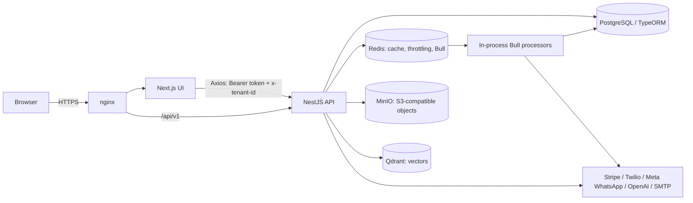
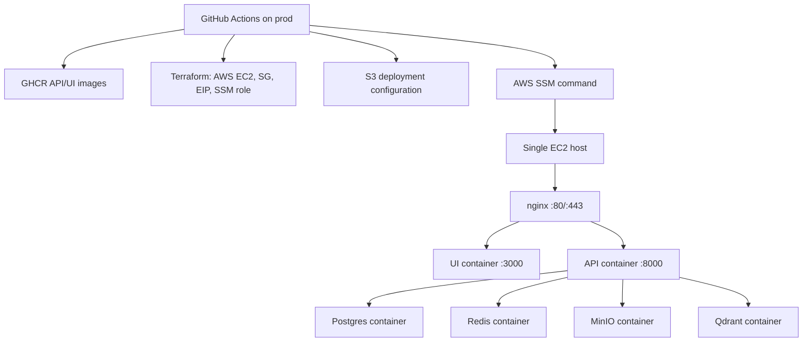
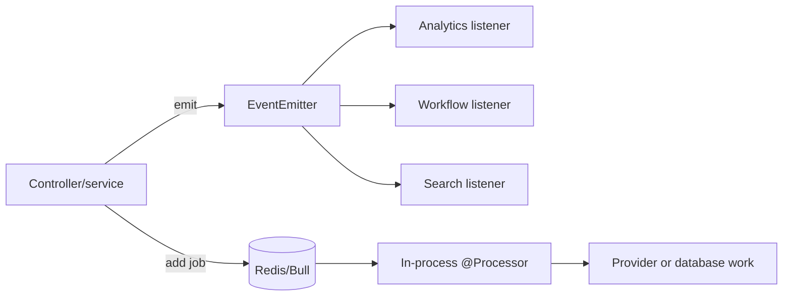
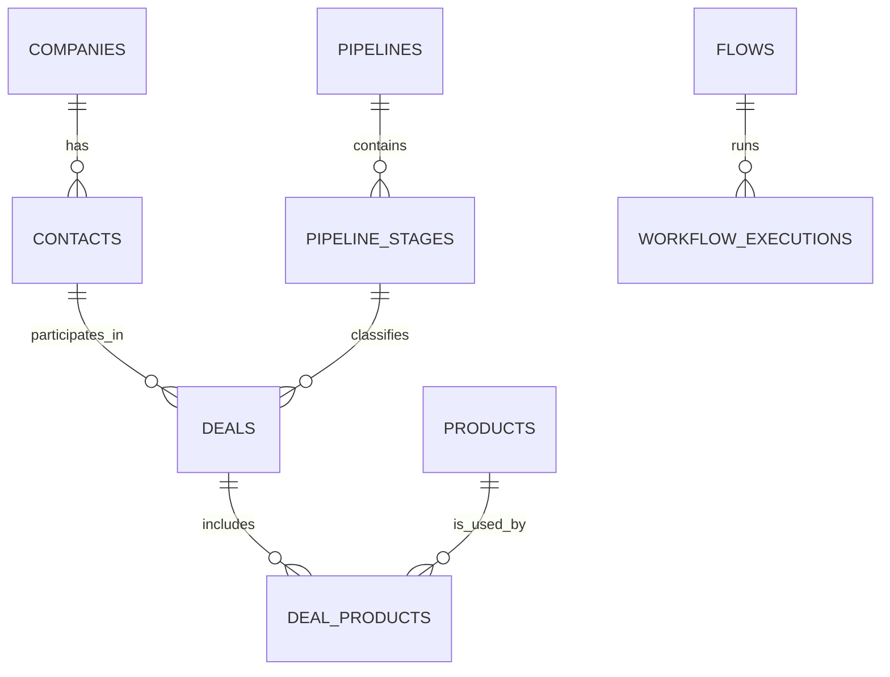

# High-Level Design — Autopilot Monster CRM

**Repository snapshot:** 2026-09-09
**Scope:** current source, configuration, Docker/Terraform, and GitHub Actions in this repository. This is implementation documentation, not a roadmap.

## 1. Executive summary

Autopilot Monster CRM is a tenant-aware web CRM that combines sales data management with billing, AI, voice, WhatsApp, workflow, reporting, administration, and developer integration APIs. The deployed application is a Next.js 16 frontend and a NestJS 11 API. PostgreSQL is the system of record; Redis backs cache and Bull queues; MinIO stores objects; Qdrant is configured for knowledge-base vector search.

The codebase contains a broad, working-shaped implementation rather than a separately deployable microservice estate: queue consumers run inside the API container, and `docker-compose.prod.yml` describes one EC2-hosted compose stack. Third-party operations require valid credentials and provider setup.

## 2. Product overview and business objectives

The product centralizes CRM records (contacts, companies, leads, deals, pipelines, products, quotes, tasks, activities, notes, tags and segments), tenant administration, subscription monetization, communications, and automation. Its business intent, evidenced by its modules and UI routes, is to let tenant teams operate customer acquisition and support workflows from one product while platform operators administer plans, tenants, queues, settings, logs, and integrations.

## 3. System overview



`nginx/nginx.conf` fronts the UI and API in the production-shaped compose deployment. The local compose file exposes the UI and API directly. `/api/v1` is applied globally by `backend/src/main.ts`; the OpenAPI JSON is exposed at `/openapi.json`, while interactive Swagger is non-production only.

## 4. Technology stack

| Layer | Implemented technology |
|---|---|
| Web UI | Next.js 16 App Router, React 19, TypeScript, Tailwind CSS, Zustand, TanStack Query, React Hook Form/Zod, Axios |
| API | NestJS 11, TypeORM, class-validator/transformer, Passport, Swagger, Socket.IO, EventEmitter2 |
| Data | PostgreSQL 15 in Compose, TypeORM migrations and entities |
| Async/cache | Redis 7, Bull via `@nestjs/bull` (not BullMQ) |
| Object/vector storage | MinIO and Qdrant |
| Integrations | Stripe, Twilio, Meta WhatsApp Cloud API, OpenAI; OAuth for Google/Facebook/GitHub/Apple; SMTP; optional ElevenLabs configuration is referenced by voice code |
| Observability/security | Winston/Nest logger, Sentry SDK, Helmet, compression, throttling, health checks |
| Delivery | Docker, Docker Compose, nginx, Terraform for AWS EC2/EIP/SSM, GitHub Actions |

## 5. Deployment architecture



The production workflow builds and publishes UI/API images, provisions or validates Terraform state, copies compose/configuration artifacts through S3, then uses SSM to run migrations and recreate compose services. `ssl-init` creates a self-signed bootstrap certificate; `certbot` has renewal wiring, but a live certificate must be bootstrapped operationally. There is no Kubernetes manifest or separate worker deployment in this repository.

## 6. Multi-tenant, authentication, and authorization design

Most business entities carry tenant context. Requests use `x-tenant-id`; the frontend Axios client obtains it from `localStorage` and sends it with the bearer token. The backend's global guard order is throttling, JWT, tenant, active-tenant, roles, permissions, plan, then limit. Endpoint decorators may opt out or add requirements.

```mermaid
sequenceDiagram
  participant B as Browser
  participant F as Next.js
  participant A as API guards
  participant S as Domain service
  participant D as PostgreSQL
  B->>F: Sign in
  F->>A: POST /api/v1/auth/login
  A-->>F: access and refresh tokens
  F->>B: secure cookies; tenant ID stored locally
  B->>A: Protected request + Authorization + x-tenant-id
  A->>A: Throttle, JWT, tenant, role/permission, plan/limit
  A->>S: Controller invokes service
  S->>D: Tenant-scoped persistence/query
  D-->>B: Transformed API response
```

The authentication module implements local login, token refresh, MFA, email/password flows, and provider strategies guarded by configuration. OAuth capability does not mean a provider is live: client IDs/secrets and callbacks must be deployed. Frontend `proxy.ts` redirects unauthenticated users and decodes token claims for coarse admin/super-admin route gating; the API remains the authorization authority.

## 7. Module catalog and dependencies

| Module group | Current implementation | Primary dependencies |
|---|---|---|
| Platform, auth, tenant, users, RBAC, tenant settings | Controllers/services/entities for tenants, teams, invitations, API keys, flags, roles, permissions, users and settings | PostgreSQL, JWT, global guards |
| CRM | Contacts, companies, leads, deals, pipelines/stages, tasks, activities, products, quotes, notes, tags, segments, custom fields, duplicate handling, forecasts, omnichannel | PostgreSQL, events, search queue, UI CRM routes |
| Billing/monetization | Plans, plan features/limits, checkout/subscriptions, invoices, payment methods, wallet, payments, coupons, usage | Stripe, PostgreSQL, billing queue |
| AI | Agents, conversations, prompts/templates, knowledge bases, RAG, fine-tuning jobs and inference queue | OpenAI, Qdrant, MinIO, Bull |
| Voice and WhatsApp | Voice calls/campaigns/numbers/Twilio callbacks; WhatsApp templates/messages/broadcasts/webhook | Twilio, Meta, Bull, PostgreSQL |
| Workflow, scheduler, social | Flows/executions, event listeners/actions, scheduled jobs; social post scheduling | EventEmitter, workflow queue, Nest schedule |
| Analytics, search, notifications, support, data jobs, storage | Dashboards/reports/events, global search, WebSocket notifications, tickets/articles, import/export/backup jobs, object files | PostgreSQL, Redis/Bull, MinIO |
| Marketplace/plugins/developer | Plugin and tenant-plugin records, marketplace templates, OAuth apps/codes, webhooks/deliveries/logs, API logs | PostgreSQL, API keys |
| Admin and sub-admin | Platform administration controllers/services and matching routes for configuration, plans, tenants, security, queues, telemetry, integrations and operations | RBAC, database, queue inspection |

The root `CoreModule` imports these modules directly. This is a modular monolith; individual module folders do not constitute independently deployable services.

## 8. API, event, and queue architecture

Synchronous HTTP traffic enters controllers, validates DTOs with the global validation pipe, calls a service/repository, and is normalized by the transform interceptor. Exception filters produce the error envelope. The API has controller prefixes for auth, CRM, AI, voice, WhatsApp, workflow, billing, analytics, marketplace, developer, admin, search, storage, import/export/backup and more; `/openapi.json` is the generated endpoint-level contract.



Registered queue names are `email`, `sms`, `whatsapp`, `voice`, `notification`, `ai-inference`, `workflow`, `billing`, `analytics`, `import`, `export`, and `search-index`. Processors exist for all 12 across the shared queue, data-jobs, workflow, and WhatsApp modules. Jobs use three attempts and exponential backoff by default. The active process both serves HTTP and consumes these queues.

## 9. Data design

The repository declares 80 `@Entity` classes: 77 decorated entities under `backend/src/database/entities` (the remaining file there is the mapped `BaseEntity`) and three auth entities under `backend/src/modules/auth/entities`. PostgreSQL migrations are the schema-change mechanism: initial/baseline/full-text/platform/extended/billing, marketplace monetization, role/permission backfills, and voice campaign-call link migrations are present.



The diagram deliberately shows the principal relationships with TypeORM relation decorators only. Many records are tenant-scoped through `tenantId` columns inherited from the base entity rather than a TypeORM `Tenant` relation; entity decorators and migrations remain authoritative for columns, nullability, and every foreign key.

## 10. Security, resilience, and operations

- **Security:** Helmet, CORS allow-list enforcement in production, JWT configuration (production supports RS256), RBAC/permissions, tenant/plan/limit guards, API keys, throttling, password/MFA/OAuth code paths, correlation IDs, and audit/security entities.
- **Errors:** `HttpExceptionFilter` and `AllExceptionsFilter` run globally; clients receive the standard transformed response/error shape. Provider failures remain dependent on provider availability and configuration.
- **Logging/monitoring:** Winston logger module, Sentry initialization, correlation/logging interceptors, health module endpoints, Compose health checks, and admin error/log/health/metrics controllers are implemented. No external metrics collector, alert manager, or managed log sink is configured in the repository.
- **Performance/scalability:** Redis cache and queues reduce synchronous work; PostgreSQL pool settings, full-text-index migration, and Qdrant are configured. Production is nevertheless a single-host compose topology with in-process workers, so API and worker load scale together.
- **Backup/DR:** backup endpoints/jobs and a MinIO backup bucket variable exist. Compose volumes persist state. There is no verified restore drill, off-site replication, RPO/RTO, or managed database configuration in this repository.

## 11. Current project status

The following is an **implementation-evidence score**, not a QA certification or production-readiness claim. It counts present UI routes, controllers/services/entities, queue processors, configurations, and IaC; it does not claim configured credentials or live provider acceptance.

| Area | Evidence-based status | Estimate |
|---|---|---:|
| Overall | Broad modular-monolith implementation with API, UI, entities, migrations, tests and deployment artifacts | 82% |
| Frontend | 337 `page.tsx` routes, reusable components/services, auth proxy | 84% |
| Backend | 122 controller files, 80 entity classes, 10 migrations, 12 queues | 86% |
| Infrastructure | Local/prod Compose, nginx, Terraform, CI/deploy workflows; single-host deployment | 74% |
| Database | Entities/migrations/repositories and PostgreSQL configuration | 82% |
| Authentication/authorization | JWT, refresh, MFA, OAuth strategies, guards/decorators and UI flows | 84% |
| CRM | Full core entity/controller/service/UI footprint | 88% |
| AI | Agents, prompts, KB/RAG, fine-tuning/inference paths; provider-dependent | 76% |
| Voice | Calls, campaigns, number management, queue and Twilio paths | 74% |
| WhatsApp | Templates, messages, broadcasts, webhook/processor paths | 78% |
| Workflow | Flow/execution entities, executor/actions/listeners/processor and UI | 82% |
| Marketplace/plugins | Entities, API services and UI; no isolated plugin runtime shown | 68% |
| Billing | Stripe/domain entities/controllers/services and UI; live price/webhook setup required | 76% |
| Analytics | Dashboards/reports/event listener/queue and UI | 78% |
| Admin/sub-admin | Large API/UI administration surface | 80% |
| Production readiness | Compose/CI/IaC/security controls exist; secrets, TLS, provider cutover, DR and scaling validation are operational gaps | 63% |

## 12. Known limitations and future scope

Known from the repository: providers are environment-dependent; Stripe rejects placeholder values; production TLS needs an operational bootstrap; queues are in-process; deployment is a single EC2 host; the deployment workflow expects `backend/.env.production` even though it is not a tracked example; and no Kubernetes, isolated workers, managed observability, or documented DR exercise is supplied.

These are limitations, not promises of future delivery. Natural next engineering investments would be worker separation, secret injection outside source/S3, managed data services, repeatable restore tests, and production provider contract tests.
