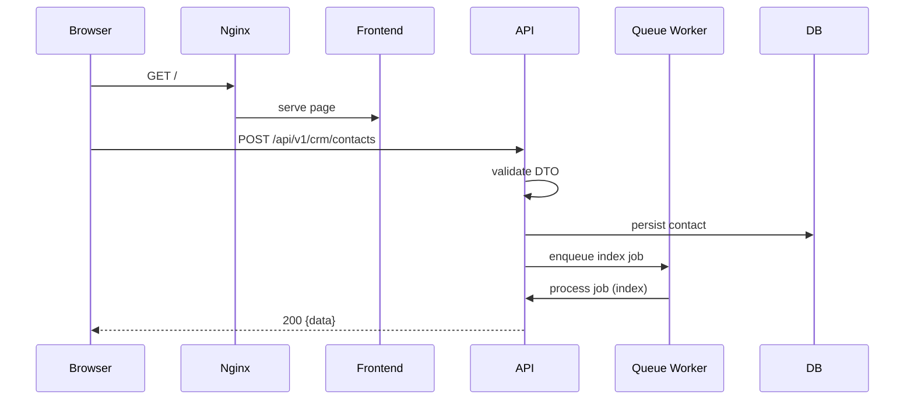

# Low Level Design (LLD)

Last updated: 2026-09-08

This LLD documents the code-level architecture and implementation details derived from the repository.

## 1. Folder Structure (selected)

```
backend/
  src/
    app.module.ts
    main.ts
    common/
      filters/
        http-exception.filter.ts
        all-exceptions.filter.ts
      guards/
        jwt-auth.guard.ts
        permission.guard.ts
        tenant.guard.ts
        roles.guard.ts
      interceptors/
        transform.interceptor.ts
        correlation-id.interceptor.ts
    modules/
      auth/
      crm/
      ai/
      voice/
      whatsapp/
      workflow/
      billing/
      developer/
      admin/
    database/
      entities/
      migrations/

frontend/
  src/
    app/ (Next.js App Router pages)
    components/
    lib/

docs/
  HLD.md
  LLD.md

nginx/
docker-compose.yml
docker-compose.prod.yml
main.tf
```

## 2. Backend Architecture

- NestJS modular design: each domain lives in its module. `CoreModule` registers global guards, filters and interceptors in `app.module.ts`.
- Global prefix `/api/v1` applied in `main.ts`.
- Swagger document built via `DocumentBuilder` and conditionally exposed at `/api/docs` (interactive UI) for non-production. Generated document is now served at `/openapi.json`.

### Global Filters & Interceptors

- `AllExceptionsFilter` (catch-all) and `HttpExceptionFilter` ensure JSON envelope responses.
- Interceptors: `CorrelationIdInterceptor`, `LoggingInterceptor`, `TransformInterceptor`, `UsageMeteringInterceptor`.

### Guards

- `MultiLevelThrottlerGuard` → throttling
- `JwtAuthGuard` → JWT validation
- `TenantGuard`/`ActiveTenantGuard` → tenant enforcement
- `RolesGuard` / `PermissionGuard` → RBAC checks

## 3. Frontend Architecture

- Next.js App Router with marketing and app routes under `frontend/src/app`.
- Server and client components used: marketing `page.tsx` provides server-rendered content for crawlers; many client pages rely on React and `use client` components.
- Edge middleware `frontend/src/proxy.ts` enforces auth redirect behavior and protects internal routes using NextResponse redirects.

## 4. Module Breakdown (examples)

- CRM (`backend/src/modules/crm`)
  - Controllers: `crm.controller.ts` and sub-controllers
  - Services: `contact.service.ts`, `lead-scoring.service.ts`, `pipeline.service.ts`
  - Entities: `contact.entity.ts`, `lead.entity.ts`, `deal.entity.ts`, `company.entity.ts`

- Auth (`backend/src/modules/auth`)
  - Controllers: `auth.controller.ts`
  - Services: `auth.service.ts`, `mfa.service.ts`
  - Guards: google/github/apple/facebook OAuth guards

- AI (`backend/src/modules/ai`)
  - Services: agent orchestration, prompt templates, fine-tuning service
  - Integration points for OpenAI and model orchestration

- Voice (`backend/src/modules/voice`)
  - Campaign processing, call entity, phone number entity, voice-call processors
  - Uses queue processors for call tasks

## 5. Controller & Service Design

- Controllers validate input via DTOs (`backend/src/modules/*/dto`) and use services for business logic.
- Services interact with TypeORM repositories and emit queue jobs for long-running tasks.

## 6. Repository Layer

- `base.repository.ts` provides shared DB access patterns. Repositories per entity under module folders use TypeORM repository patterns.

## 7. Entity Relationships

- There are many entities; common relationships:
  - `Tenant` 1..* `User`
  - `Company` 1..* `Contact`
  - `Deal` links to `Contact`, `Pipeline`, `Stage`
  - `OAuthApp` entity exists for developer apps

Refer to `backend/src/database/entities` for concrete schemas.

## 8. DTO Design & Validation

- Validation via `class-validator` and global `ValidationPipe` (`ValidationPipe` used globally in `app.module.ts`).

## 9. Authentication & Authorization Flow

- Login endpoints return access & refresh tokens.
- Token refresh flows implemented (`/auth/refresh`).
- Guards enforce authentication and authorization; exceptions map to JSON error envelope.

## 10. API Endpoint Reference (high-level)

- `/api/v1/auth` — login, refresh, oauth callbacks
- `/api/v1/crm` — contacts, companies, leads, deals
- `/api/v1/voice` — voice campaigns, calls
- `/api/v1/whatsapp` — templates, inbox
- `/api/v1/ai` — agents, prompts, training
- `/api/v1/workflow` — workflow definitions & executions
- `/api/v1/billing` — checkout, subscriptions, invoices

## 11. Database Schema

- Entities are under `backend/src/database/entities`. Many domain tables are implemented; use `migrations/` to see DDL changes. Migrations present for core schema and feature updates.

## 12. Redis Usage

- Redis used for: Bull queues, caching, rate-limiting / throttling, session-like ephemeral data.

## 13. Queue Processing

- Queue processors under `backend/src/queue/processors` and per-module processors handle background jobs.

## 14. BullMQ Workers

- Workers are registered via NestJS queue modules. Jobs include workflow execution, voice call tasks, email, indexing.

## 15. Event Emitters

- `event-bus.module.ts` provides an event bus pattern; modules publish internal events for asynchronous processing.

## 16. Background Jobs & Scheduler

- `ScheduleModule` is enabled; scheduled tasks live under scheduler modules.

## 17. File & Object Storage

- Storage abstraction writes to MinIO (S3-compatible). Upload endpoints and storage modules present.

## 18. AI Architecture

- AI module integrates with OpenAI; vector embeddings persisted to Qdrant (config present). Prompt templates and fine-tuning service exist.

## 19. Voice Architecture

- Voice module enqueues call jobs; processing pipeline handles STT/TTS, sentiment analysis (OpenAI/ElevenLabs optional). Phone-number and call entities tracked in DB.

## 20. WhatsApp Architecture

- WhatsApp module supports templates, inbox & broadcast; integrates with Meta WhatsApp Cloud via services.

## 21. Workflow Engine

- Workflow module supports template definitions, triggers, and action execution; long-running tasks are queued.

## 22. Billing Engine

- Billing integrates with Stripe; prices seeded via env variables and admin features to manage plans.

## 23. Marketplace Engine

- Marketplace module and plugin entities exist; marketplace templates and plugin metadata are stored and referenced.

## 24. Analytics Engine

- Analytics modules provide dashboards and export functionality; events, metrics and usage metering produced by interceptors.

## 25. Error Handling

- Exception filters convert all errors into the `IApiResponse` JSON envelope with keys (`status`, `message`, `error`, `data`).

## 26. Logging

- Logger service present; Sentry integration configured in `main.ts`.

## 27. Configuration Management

- Config is driven by `@nestjs/config` factories under `backend/src/config`. Frontend uses `NEXT_PUBLIC_*` env variables.

## 28. Environment Variables

- See `backend/.env.example` and `frontend/.env.example` for full lists. Critical keys: `DATABASE_URL`, `JWT_*`, `STRIPE_*`, `TWILIO_*`, `OPENAI_API_KEY`, `MINIO_*`, `REDIS_URL`.

## 29. Dependency Graph (high level)

- Backend modules depend on shared `common` utilities and `database` module. Frontend calls backend via proxied `/api` rewrites to external API during runtime.

## 30. Request & Response Lifecycle

- Request enters NestJS -> Guards -> Pipes (validation) -> Controllers -> Services -> DB/Queues -> Response transformed by `TransformInterceptor` to standardized envelope.

## 31. Sequence Diagrams



## 32. Current Implementation Notes

- Many modules are fully implemented and tested (backend unit tests pass). API documentation generation and OpenAPI exposure are present and served at `/openapi.json`.
- Frontend provides marketing pages, app pages, and admin/superadmin sections with many routes under `frontend/src/app`.

---

References: code in `backend/` and `frontend/` directories (2026-09-08 snapshot).
