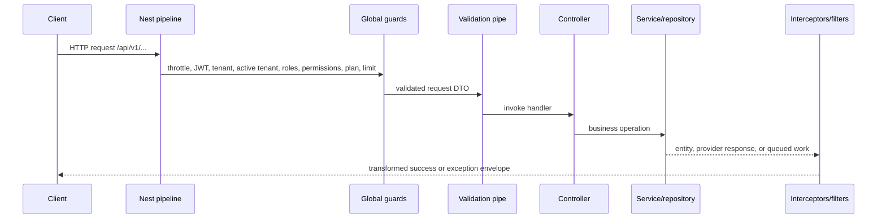
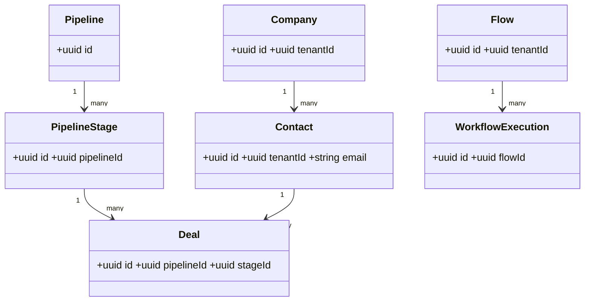
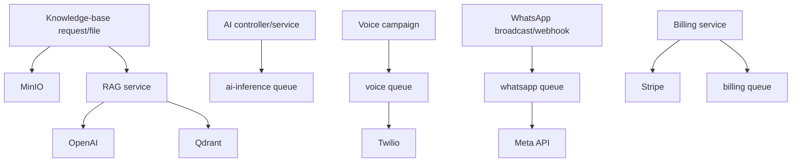

# Low-Level Design — Autopilot Monster CRM

**Repository snapshot:** 2026-09-09. Paths and behavior below are taken from the checked-in source. “Partial” means code exists but needs external setup or the repository does not demonstrate a complete production boundary.

## 1. Repository and folder structure

```text
backend/
  src/main.ts                 # Bootstrap, CORS, Swagger/OpenAPI, Sentry
  src/app.module.ts           # CoreModule and global Nest providers
  src/common/                 # decorators, guards, filters, pipes, interceptors
  src/config/                 # app, database, Redis, MinIO, Qdrant, JWT, throttle config
  src/database/               # TypeORM module, 78 entity files (77 decorated), 10 migrations
  src/queue/                  # Bull root config, constants, shared processors
  src/events/                 # EventEmitter configuration
  src/modules/                # domain modules
  src/storage/, health/, cache/, logger/, shared/
frontend/
  src/app/                    # Next.js App Router pages and route groups
  src/components/             # UI, CRM, layout, marketing, settings, social, FlowBuilder
  src/services/               # API domain clients
  src/lib/api/                # Axios client, response and pagination helpers
  src/hooks/                  # custom React hooks
  src/proxy.ts                # Next request access/role routing
docs/                         # architecture and feature documentation
docker-compose*.yml           # local and production-shaped stacks
nginx/, *.tf, .github/        # ingress, AWS Terraform, CI/CD
```

There is no root `package.json`. `backend/package.json` is the NestJS package; it declares unused-looking workspace/turbo scripts alongside normal backend scripts. `frontend/package.json` is an independent Next.js package.

## 2. Backend composition and request lifecycle

`main.ts` creates `CoreModule`, enables raw body handling, Helmet, compression, CORS, the `/api/v1` prefix, shutdown hooks, Sentry initialization, and Swagger/OpenAPI generation. It serves `/openapi.json` without authentication; Swagger UI at `/api/docs` is enabled only outside production. The optional MCP handshake route is registered only when `PUBLISH_OPENAPI` resolves true through app configuration.



### Global providers

| Kind | Implementations |
|---|---|
| Filters | `AllExceptionsFilter`, `HttpExceptionFilter` |
| Interceptors | `CorrelationIdInterceptor`, `LoggingInterceptor`, `TransformInterceptor`, `UsageMeteringInterceptor` |
| Guards | `MultiLevelThrottlerGuard`, `JwtAuthGuard`, `TenantGuard`, `ActiveTenantGuard`, `RolesGuard`, `PermissionGuard`, `PlanGuard`, `LimitGuard` |
| Pipe | custom `ValidationPipe` |
| Config | `app`, `database`, `redis`, `minio`, `qdrant`, `jwt`, `throttle` factories |

Controllers use DTO classes in their module `dto/` folders and decorate handlers with Nest Swagger, permission, role, tenant, feature, plan and limit metadata where required. Services use `TypeOrmModule.forFeature` repositories directly or module-specific repositories such as CRM, tenant, workflow, voice, WhatsApp, RBAC and pricing repositories. `BaseRepository` provides shared repository patterns.

## 3. Frontend architecture

The UI is Next.js App Router. The source contains 337 `page.tsx` files, grouped into public marketing, auth, tenant app, admin, and super-admin routes. Services in `frontend/src/services` make domain-specific calls through `frontend/src/lib/api/client.ts`; that Axios instance adds `Authorization` from the `access_token` cookie and `x-tenant-id` from `localStorage`, refreshes on one 401 retry, and redirects on 403.

`frontend/src/proxy.ts` treats marketing/auth paths as public, redirects unauthenticated internal traffic to login, and checks token role claims before `/admin` and `/superadmin` routes. This is navigation protection only; API guards enforce permissions.

| UI surface | Implemented route families |
|---|---|
| Public/auth | `/`, `/pricing`, product/marketing pages, `/login`, `/register`, password/email/MFA routes |
| Tenant application | `/dashboard`, `/crm/*`, `/ai/*`, `/voice/*`, `/whatsapp/*`, `/workflows/*`, `/billing/*`, `/analytics/*`, `/marketplace`, `/settings/*`, `/storage`, import/export/backup |
| Administration | `/admin/*`: CRM, RBAC, users, billing, support, integrations, queues, worker/system/security settings |
| Platform operations | `/superadmin/*`: tenants, plans, invoices/subscriptions, marketplace, metrics, security, system, telemetry |

## 4. Domain/module design

| Module | Controller/service/entity evidence | Status and limits |
|---|---|---|
| Auth | `auth.controller.ts`, auth/MFA services, strategies and DTOs | Implemented; OAuth flows need provider credentials/callbacks |
| Tenant, users, RBAC, settings | tenant/team/API key/flag controllers; users and RBAC modules; tenant settings | Implemented tenant control plane |
| CRM | `crm.controller.ts`, reports/duplicates/omnichannel/quote-public controllers; 20 services and 5 repositories | Implemented core CRM; includes leads, contacts, companies, deals, pipelines, products, quotes, tasks and support records |
| Billing and monetization | billing controllers/services, pricing repository, `MonetizationModule` | Implemented application paths; live Stripe operation is configuration-dependent |
| AI | six controllers, agents/conversations/prompts/KB/fine-tuning services, RAG and inference queue service | Partial operationally: requires OpenAI/Qdrant/MinIO availability |
| Voice | voice, campaign and Twilio controllers; call/campaign/number services/repository | Partial operationally: requires Twilio and configured phone numbers |
| WhatsApp | WhatsApp and Meta webhook controllers; service/template/broadcast/repository/processor | Partial operationally: requires Meta account/token/webhook setup |
| Workflow | workflows/meta controllers, repository, executor/action executor/event listener/processor | Implemented workflow runtime in-process |
| Analytics/search | analytics dashboard/report/advanced controllers, event listener, queue service; search controller/listener | Implemented code paths; reporting data quality depends on emitted events |
| Storage/data jobs | storage controllers/service, import/export/backup controllers and processors | Implemented; MinIO is required for object/backup operations |
| Marketplace/plugins/developer | marketplace/template, plugin, OAuth/webhook/API-log controllers/services | Partial: registry/management is present; no separate sandboxed plugin execution host is present |
| Social/scheduler/support/notifications | social scheduler/service, scheduled-job repository, support, WebSocket notification gateway | Implemented module artifacts; social providers are not established in checked-in configuration |
| Admin/sub-admin/platform | 53 admin and 15 sub-admin controller/service files, platform module | Implemented administration surface; dependent on global authorization |

## 5. Database schema and relationships

The database is PostgreSQL through TypeORM. `DatabaseModule` resolves config and enables `autoLoadEntities`. There are 80 decorated entity classes: 77 in `backend/src/database/entities` plus user, session, and refresh-token entities in `backend/src/modules/auth/entities`. Migrations live in `backend/src/database/migrations`; production Compose sets `DB_SYNCHRONIZE=false`, so migrations are the production schema mechanism.

### Entity/table inventory by domain

| Domain | Tables declared by entity decorators |
|---|---|
| Identity/tenant | `tenants`, `users` (entity exists though table name is inherited/configured), `roles`, `permissions`, `user_roles`, `team_groups`, `invitations`, `tenant_settings`, `feature_flags`, `api_keys` |
| CRM | `contacts`, `companies`, `leads`, `deals`, `deal_histories`, `deal_products`, `pipelines`, `pipeline_stages`, `products`, `quotes`, `tasks`, `activities`, `notes`, `crm_tags`, `crm_segments`, `crm_custom_fields`, `campaigns`, `crm_emails` |
| Billing | `plans`, `plan_features`, `plan_limits`, `subscriptions`, `invoices`, `payments`, `payment_methods`, `coupons`, `wallets`, `wallet_transactions`, `usage_records` |
| AI/comms | `agents`, `ai_prompts`, `prompt_templates`, `knowledge_bases`, `fine_tuning_jobs`, `conversations`, `messages`, `voice_calls`, `voice_campaigns`, `voice_phone_numbers`, `whatsapp_messages`, `whatsapp_templates`, `whatsapp_broadcasts` |
| Automation/ops | `flows`, `workflow_executions`, `scheduled_jobs`, `data_jobs`, `storage_files`, `notifications`, `analytics_dashboards`, `analytics_reports`, `dashboard_metrics`, `social_posts` |
| Platform/developer/security | `plugins`, `tenant_plugins`, `marketplace_templates`, `oauth_apps`, `oauth_codes`, `webhooks`, `webhook_deliveries`, `webhook_logs`, `api_logs`, `audit_logs`, `error_logs`, `platform_settings`, `announcements`, `tickets`, `articles`, `ip_whitelists`, `consent_records` |



The diagram contains only relation-decorator associations. Tenant scoping is principally represented by `tenantId` columns (including columns inherited from `BaseEntity`), rather than a TypeORM `Tenant` relation. Inspect entities/migrations for exact relation decorators and constraints.

## 6. Endpoint reference

All routes below are relative to `/api/v1`; method-level operations are generated from controller decorators into `/openapi.json`. This grouped reference avoids inventing individual request shapes.

| Prefixes implemented by controllers | Responsibility |
|---|---|
| `auth` | identity, refresh, MFA and OAuth |
| `crm`, `crm/duplicates`, `crm/reports`, `crm/quotes`, `omnichannel` | sales CRM and public quote access |
| `ai`, `ai/agents`, `ai/prompts`, `ai/templates`, `ai/conversations`, `ai/knowledge-bases`, `ai/fine-tuning` | AI resources and inference-related operations |
| `voice`, `voice/campaigns`, `voice/twilio`; `whatsapp`, `whatsapp/webhook` | voice and WhatsApp |
| `workflows` plus root workflow metadata routes | workflows and execution metadata |
| `billing`, `billing/coupons`, `monetization` | billing, coupons and pricing/usage controls |
| `analytics`, `analytics/advanced`, `analytics/dashboards`, `analytics/reports`, `search` | reporting and search |
| `marketplace`, `marketplace/templates`, `plugins`, `developer/oauth`, `developer/webhooks`, `developer/logs` | ecosystem/developer operations |
| `teams`, `users`, `rbac`, `settings/*`, root tenant/platform routes | tenant and access management |
| `notifications`, `support`, `social`, `scheduler`, `storage`, `storage/files`, `import`, `export`, `backup`, `health` | operational domain endpoints |
| `admin/*`, `sub-admin/*` | platform and delegated administration |

## 7. Redis, Bull, events, scheduling and background work

`QueueModule` configures Bull using the Redis config and registers 12 queues. It sets `removeOnComplete: true`, retains failed jobs, and defaults to 3 exponential-backoff attempts. Despite the requested term “BullMQ workers,” the installed and used library is **Bull 4 / `@nestjs/bull`**, with `@Processor` and `@Process` decorators—not BullMQ.

| Queue | Processor/job evidence |
|---|---|
| `email`, `sms`, `notification` | shared email/SMS/notification processors |
| `voice`, `ai-inference`, `billing`, `analytics`, `search-index` | shared processors for voice, inference, billing, analytics events, index documents |
| `workflow` | `WorkflowProcessor` executes workflow jobs |
| `whatsapp` | `WhatsappBroadcastProcessor` handles broadcast messages |
| `import`, `export` | `DataJobProcessor` handles import, export, and backup job names |

The global `EventBusModule` enables wildcard `EventEmitter2`. Analytics, workflow, CRM automation and search listeners subscribe to events such as contact/deal lifecycle changes and calls/messages. `SocialSchedulerService` is the visible `@Cron` implementation and runs every minute. All queue consumers are in the API process; no separate worker image/module deployment is configured.

## 8. AI, voice, WhatsApp, file and billing flows



`StorageService` is the object-storage abstraction used by storage and data processing features. AI RAG and fine-tuning records exist, but model/provider availability is external. Voice exposes Twilio callback routes and queue processing. WhatsApp exposes a Meta webhook controller and broadcast processor. Billing uses Stripe and validates price configuration; PayPal and Razorpay environment keys exist, but this repository should not be read as evidence of a complete PayPal/Razorpay processing implementation.

## 9. Error, logging, response and configuration design

- Validation is global and uses class-validator DTO metadata.
- Exceptions pass through the global filters; successful controller output passes the transform interceptor. API client helpers account for the `{ status, message, error, data }` shape.
- Correlation and logging interceptors run globally. `LoggerModule` provides application logging; Sentry is initialized at API boot when its DSN is available.
- Environment contracts are documented by `.env.example`, `backend/.env.example`, `backend/.env.production.example`, `frontend/.env.example`, and `frontend/.env.production.example`. Backend groups cover app/URLs, DB, Redis, JWT, OAuth, MinIO, Qdrant, SMTP, Stripe, WhatsApp and provider-specific keys. Frontend exposes API URL and Stripe publishable key only.

## 10. Implementation notes and limitations

- **Implemented:** entities, migrations, API/UI module footprints, global security pipeline, Compose stacks, Terraform, CI, API/OpenAPI generation, Bull processors, event listeners, storage abstraction and health endpoints.
- **Partial/external:** live payment, telephony, Meta, OpenAI, OAuth and SMTP behavior depends on credentials/provider configuration. Qdrant is present in compose/configuration but not proof of a provisioned production collection/service.
- **Not implemented in repository:** Kubernetes manifests, a separately scaled worker service, managed monitoring/alerting/log export, a documented restore test, and a sandboxed marketplace plugin-runtime boundary.
- **Production caveat:** the deploy workflow references a real `backend/.env.production`, which is not included; operational secret delivery needs validation before deployment.
