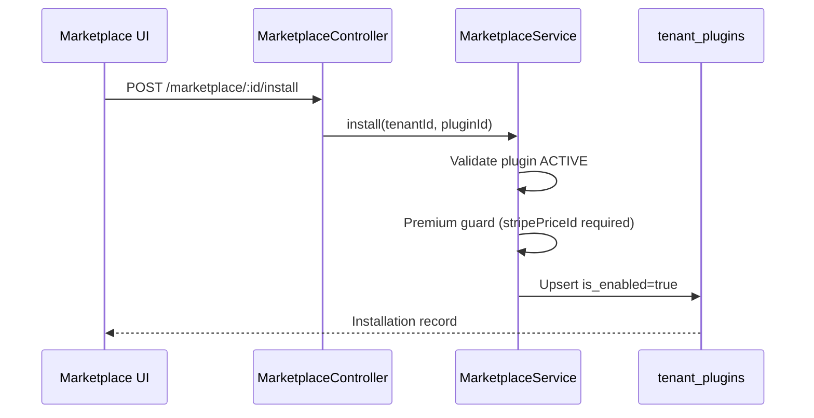

# Marketplace & Plugin System Audit

**Agent:** AGENT 13 — MARKETPLACE AUDITOR  
**Date:** 2026-06-19  
**Scope:** Marketplace listings, plugin system, workflow templates, vendor accounts, install process, billing, revenue sharing

---

## Executive Summary

The marketplace/plugin system had a working core data model (`plugins`, `tenant_plugins`) and partially wired tenant marketplace UI, but several critical paths were stubbed or disconnected. This audit identified **11 issues**, fixed **9**, and documented **4 remaining gaps** that require larger platform work (OAuth, Stripe Connect, vendor portal).

| Area | Before | After |
|------|--------|-------|
| Tenant marketplace (`/marketplace`) | Wired to API | ✅ Working |
| Plugin install/uninstall | Backend OK, schema mismatch | ✅ Fixed (`is_enabled`) |
| Plugins page (`/plugins`) | Mock data | ✅ Wired to `/plugins` API |
| `PluginsController` | Returned `[]` stub | ✅ Real `PluginsService` |
| Admin plugin catalog | DTO mismatch, no install counts | ✅ Fixed + counts |
| Superadmin inventory/catalog | Raw `fetch()` without auth | ✅ Uses `adminMarketplaceService` |
| Admin tenant marketplace | Raw `fetch()` | ✅ Uses `subAdminMarketplaceService` |
| Monetization dashboard | Generic billing stats only | ✅ Plugin-specific endpoint |
| Seed data | No plugins | ✅ 5 demo plugins |
| Vendor accounts | Not implemented | ⚠️ Partial (`vendorId` on plugin) |
| OAuth install flow | Not implemented | ❌ Not in scope |
| Stripe Connect payouts | Not implemented | ❌ Not in scope |
| Workflow templates (marketplace) | Separate from plugins | ⚠️ Documented |

---

## 1. Marketplace Listings

### Backend

| Endpoint | Module | Status |
|----------|--------|--------|
| `GET /marketplace` | `MarketplaceController` | ✅ Lists ACTIVE plugins |
| `GET /marketplace/:id` | `MarketplaceController` | ✅ Plugin detail |
| `GET /marketplace/installed` | `MarketplaceController` | ✅ Tenant installations |
| `POST /marketplace/:id/install` | `MarketplaceController` | ✅ Install with premium guard |
| `DELETE /marketplace/:id/uninstall` | `MarketplaceController` | ✅ Soft-disable (`is_enabled=false`) |
| `GET /admin/marketplace/plugins` | `AdminMarketplaceController` | ✅ CRUD + install counts |
| `GET /admin/marketplace/monetization` | `AdminMarketplaceController` | ✅ **Added** |
| `GET /sub-admin/marketplace/discover` | `SubAdminMarketplaceController` | ✅ **Fixed** — includes `isInstalled` |

### Frontend

| Page | Path | API | Status |
|------|------|-----|--------|
| Marketplace browse | `/marketplace` | `marketplaceService` | ✅ |
| App detail | `/marketplace/[id]` | `marketplaceService` | ✅ |
| Installed apps | `/marketplace/installed` | `marketplaceService` | ✅ |
| Superadmin catalog | `/superadmin/marketplace/catalog` | `adminMarketplaceService` | ✅ |
| Superadmin inventory | `/superadmin/marketplace/inventory` | `adminMarketplaceService` | ✅ **Fixed** |
| Superadmin overview | `/superadmin/marketplace` | `adminMarketplaceService` | ✅ **Fixed** |
| Admin marketplace | `/admin/marketplace` | `subAdminMarketplaceService` | ✅ **Fixed** |

### Data Model — `plugins`

```
plugins
├── id, tenant_id (platform catalog tenant)
├── name, slug, description, version, author, category
├── isPremium, price_monthly, vendor_id, stripe_price_id  ← added
├── status (ACTIVE | INACTIVE)
└── configSchema (jsonb)
```

### Seed Data

Added `seed-marketplace-plugins.ts` with 5 demo plugins (Slack, Stripe, Zapier, HubSpot Sync, AI Lead Scorer). Run via `npm run seed` in backend.

---

## 2. Plugin System

### Issues Found & Fixed

| Issue | Severity | Fix |
|-------|----------|-----|
| `PluginsController` returned hardcoded `[]` | Critical | Created `PluginsService`, wired controller |
| `/plugins` page used static mock array | Critical | Client component + `pluginsService` |
| `AdminPluginsService` returned fake data | High | Queries `Plugin` + `TenantPlugin` repos |
| `TenantPlugin` entity used `status`/`lastSyncAt` but DDL has `is_enabled`/`installed_at` | Critical | Aligned entity to DDL |
| `CreatePluginDto` used `isActive` but entity uses `status` | Medium | DTO + service mapping fixed |
| Plugin create missing `tenantId`/`slug` | High | Platform tenant lookup + slugify |
| No `PluginsService` in `PlatformModule` | High | Registered provider |

### Backend Modules

```
backend/src/modules/
├── marketplace/          ← tenant-facing catalog + install
├── plugins/              ← tenant installed plugins (FIXED)
├── admin/marketplace/    ← superadmin catalog CRUD
├── admin/plugins/        ← superadmin install overview (FIXED)
├── sub-admin/marketplace/← admin-role tenant discovery (FIXED)
└── sub-admin/plugins/    ← admin-role tenant plugin mgmt (FIXED)
```

### Frontend Services

| Service | Path | Status |
|---------|------|--------|
| `marketplace.service.ts` | Tenant marketplace | ✅ |
| `plugins.service.ts` | Installed plugins | ✅ **Added** |
| `admin-marketplace.service.ts` | Superadmin catalog | ✅ Enhanced |
| `sub-admin-marketplace.service.ts` | Admin discovery | ✅ |
| `admin-plugins.service.ts` | Superadmin plugins | ✅ |
| `sub-admin-plugins.service.ts` | Admin plugins | ✅ |

---

## 3. Workflow Templates

Workflow templates are **not marketplace plugins**. They live in the workflow module:

| Component | Location | Status |
|-----------|----------|--------|
| Template variable resolution | `workflow-template.util.ts` | ✅ Runtime util |
| Templates UI | `/workflows/templates` | ✅ Lists triggers/actions from `workflowService` |
| Marketplace workflow plugins | N/A | ❌ Not implemented |

**Note:** The workflow templates page shows available triggers and actions for the builder — not installable marketplace workflow packs. A future "Workflow Template Pack" would be a `Plugin` with `category: 'Automation'` and a manifest in `configSchema`.

---

## 4. Vendor Accounts

### Current State

| Feature | Status |
|---------|--------|
| `vendorId` on `Plugin` entity | ✅ Added |
| Vendor user/tenant entity | ❌ Not implemented |
| Developer portal / registration | ❌ Not implemented |
| Stripe Connect onboarding | ❌ Not implemented (designed in `Docs/plugin_pricing.md`) |
| OAuth client credentials per app | ❌ Not implemented (designed in `Docs/marketplace_design.md`) |

`author` field serves as display name; `vendorId` is a string reference for future vendor table.

---

## 5. Install Process

### Flow (Current — Simplified)



### Gaps vs Design Doc

| Designed Flow | Current |
|---------------|---------|
| OAuth 2.0 authorization | ❌ Direct DB install only |
| Scope review screen | ❌ Not implemented |
| Webhook subscription on install | ❌ Not implemented |
| Manifest / UI extension injection | ❌ Not implemented |

---

## 6. Billing & Revenue Sharing

### Current State

| Feature | Status |
|---------|--------|
| `isPremium` flag on plugins | ✅ |
| `priceMonthly` + `stripePriceId` on plugins | ✅ Added |
| Premium install guard | ✅ Blocks if premium without `stripePriceId` |
| Add subscription item on install | ❌ Not implemented |
| Usage metering per plugin | ❌ Not implemented |
| `GET /admin/marketplace/monetization` | ✅ **Added** — aggregates premium installs |

### Revenue Model (from `Docs/plugin_pricing.md`)

- **Free:** 1-click install
- **Monthly subscription:** Stripe price added to tenant invoice
- **Revenue split:** 80% developer / 20% platform
- **Payouts:** Stripe Connect Express (not built)

### Monetization Endpoint Response

```json
{
  "grossVolume": 44,
  "platformShare": 8.8,
  "developerShare": 35.2,
  "pendingPayouts": 35.2,
  "premiumPluginCount": 2,
  "premiumInstallCount": 0,
  "revenueShareRate": 0.2
}
```

Superadmin monetization page now uses this endpoint instead of generic billing stats.

---

## 7. Admin Pages Audit

| Page | Role | Wired | Notes |
|------|------|-------|-------|
| `/admin/marketplace` | ADMIN | ✅ | Sub-admin discover + install |
| `/superadmin/marketplace` | SUPER_ADMIN | ✅ | Global plugin overview |
| `/superadmin/marketplace/catalog` | SUPER_ADMIN | ✅ | Category/collection taxonomy |
| `/superadmin/marketplace/inventory` | SUPER_ADMIN | ✅ | Plugin cards + install counts |
| `/superadmin/marketplace/monetization` | SUPER_ADMIN | ✅ | Plugin revenue stats |
| `/superadmin/marketplace/verification` | SUPER_ADMIN | ⚠️ | UI only, no backend |
| `/superadmin/marketplace/categories` | SUPER_ADMIN | ⚠️ | UI only, no CRUD API |

---

## 8. Fixes Applied (This Audit)

### Backend
1. `plugins.service.ts` — new tenant plugin service
2. `plugins.controller.ts` — wired to service with `TenantId`
3. `marketplace.service.ts` — `is_enabled` alignment + premium guard
4. `tenant-plugin.entity.ts` — DDL alignment (`is_enabled`, `installed_at`)
5. `plugin.entity.ts` — monetization columns (`priceMonthly`, `vendorId`, `stripePriceId`)
6. `admin-marketplace.dto.ts` — full field mapping
7. `admin-marketplace.service.ts` — create/update fix, install counts, monetization
8. `admin-plugins.service.ts` — DB-backed
9. `sub-admin-marketplace.service.ts` — `isInstalled` flag
10. `sub-admin-plugins.service.ts` — `is_enabled` alignment
11. `seed-marketplace-plugins.ts` — demo catalog
12. Migration `1740000000001-MarketplaceMonetizationColumns.ts`

### Frontend
1. `plugins.service.ts` — new API client
2. `plugins/page.tsx` — live data from API
3. `admin/marketplace/page.tsx` — `subAdminMarketplaceService`
4. `superadmin/marketplace/page.tsx` — `adminMarketplaceService`
5. `superadmin/marketplace/inventory/page.tsx` — `adminMarketplaceService`
6. `superadmin/marketplace/monetization/page.tsx` — plugin monetization API
7. `marketplace.service.ts` — `isEnabled` type fix

---

## 9. Remaining Gaps (Priority Order)

| # | Gap | Priority | Effort |
|---|-----|----------|--------|
| 1 | Stripe subscription item on premium install | High | L |
| 2 | Vendor entity + developer portal | High | L |
| 3 | OAuth 2.0 install flow | Medium | L |
| 4 | Stripe Connect payout automation | Medium | L |
| 5 | Plugin webhook event subscriptions | Medium | M |
| 6 | UI extension manifest injection | Low | M |
| 7 | Marketplace verification workflow API | Low | S |
| 8 | Category CRUD (separate from plugin.category) | Low | S |
| 9 | Integration tests for marketplace install | Medium | M |
| 10 | Workflow template packs as marketplace items | Low | M |

---

## 10. Test Recommendations

```bash
# Seed plugins
cd backend && npm run seed

# Manual verification
GET  /api/v1/marketplace                          # Public catalog
GET  /api/v1/marketplace/installed              # Auth required
POST /api/v1/marketplace/:id/install            # Auth required
GET  /api/v1/plugins                              # Installed plugins
GET  /api/v1/admin/marketplace/plugins          # Super admin
GET  /api/v1/admin/marketplace/monetization     # Revenue stats
GET  /api/v1/sub-admin/marketplace/discover     # Admin role
```

---

## 11. Conclusion

The marketplace/plugin system now has a **functional install loop** from catalog browse → install → installed list → uninstall, with superadmin catalog management and basic monetization tracking. The largest remaining work is **billing integration** (Stripe subscription items on install) and **vendor infrastructure** (accounts, Connect payouts, OAuth) as designed in `Docs/marketplace_design.md` and `Docs/plugin_pricing.md`.
